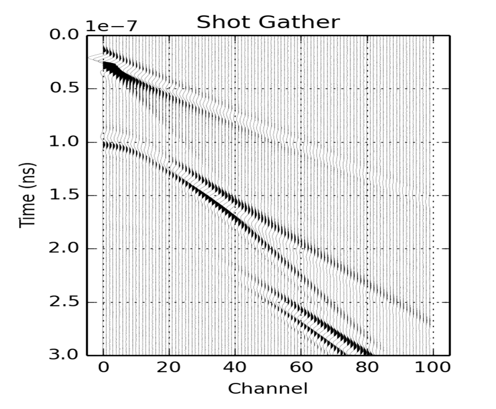

.. image:: simpeg-logo.png
   :width: 300 px
   :alt: SimPEG
   :align: center

SimPEG (Simulation and Parameter Estimation in Geophysics) is a python package for simulation and gradient based parameter estimation in the
context of geoscience applications. simpegGPR uses SimPEG as the framework for the forward modeling and inversion of ground penetrating radar (GPR) geophysical problem.

Maxwell's equations, which is governing equations of GPR can be solved in both time and frequency domains. We initially discretize those problems to compute forward responses in frequency and time domain. Obvious next step is to apply inverse problems

We welcome any people who want to contribute this project developing forward modeling and inversion package of GPR data, simpegGPR.

This package also has educational purposes. For instance, consider the ray paths of GPR: a. air wave, b. ground wave, c. reflected wave and e. refracted wave can be observed in the data:

   Figure 1. A shot gather of GPR data.

In addition, we can clearly identify those phenomenon by simply looking a movie, which shows GPR wave propagation in layer model:

.. raw:: html
    :file: examples/raypaths.html

    Ray paths of EM wave propagation. We identify

Time domain GPR
===============

.. toctree::
   :maxdepth: 2

   api_GPRTD

License
=======

.. toctree::
   :maxdepth: 2

   api_license

Project Index & Search
======================

* :ref:`genindex`
* :ref:`modindex`
* :ref:`search`

